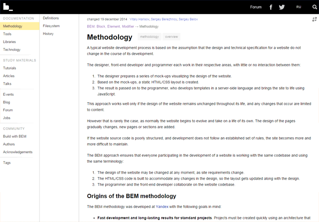

# 聊一聊CSS方法论

> **原文链接：**[A Look at Some CSS methodologies]()

CSS在大型，复杂，快速迭代的系统中难以管理的程度是出了名的。

其中一个原因是CSS缺少内置的作用域管理机制。在CSS中，所有的一切都是全局的，这意味着任何你所做的改变都有可能层叠或者改变完全没有相关的那部分UI。

扩展的CSS语言，也称作[CSS预处理器](http://sixrevisions.com/elsewhere-on-the-web/the-best-css-preprocessors-right-now/)，比如说Sass，Less和Stylus，通过增加一些新的特性让写CSS代码变得更简单一点。但是就算有这些扩展性的CSS语言，在我看来，也并没有解决可扩展性问题。

在CSS没有自己的作用域机制之前，我们不得不设计出自己的一套系统来防止HTML文档的特定区域不被收到影响。

下面是关于CSS方法论的介绍可能让我们找到一些答案。

在这篇文章中，我们来看看这些CSS方法论：

- 面向对象的CSS（Object-Oriented CSS(OOCSS)）
- 块，元素，修饰符（Block,Element,Modifier(BEM)）
- 可扩展性和模块化性CSS架构（Scalable and Modular Architecture for CSS(SMACSS)）
- SUIT CSS
- 系统化CSS（Systematic CSS）

CSS方法论是正式的，文档化写CSS的方法系统，它能够让我们以一系列小的，独立的方式来开发，维护和扩展前端代码。而不是作为一大块整体的不可分割的代码。

采用一种CSS方法论，甚至是你自己创建的一种，无论项目的大小和复杂度都会让CSS变得更好设计并且更好地在设计项目中迭代。

**相关：**[大型网站的CSS开发](http://sixrevisions.com/css/css-development-at-large-sites/)

每一种CSS方法论都提供了一系列略微不同的解决CSS可扩展性/可维护性的方法。一个CSS方法论通常会定义一些指南：

- CSS和HTML最佳实践
- Class和ID命名规范
- CSS样式规则的排序和组合
- 代码格式

世界上并没有“最佳”的CSS方法论。不同的方法适应于不同的个人/项目组/项目。

我们希望的是，通过了解目前已经存在的CSS方法论可以帮助我们找到一种适应我们需求的方法。或者它也许能激发你的创造力，让你创建一个你自己专属的CSS方法论。

## 面向对象的CSS（OOCSS）

Nicole Sullivan的面向对象的CSS，或者简单来说OOCSS，在2009年发布。

这实际上是第一个大范围采用的CSS方法论。甚至到现在也有很大的影响力。

OOCSS鼓励结构和样式的分离。这个方法论在内容和容器之间有着明显的区分。

在OOCSS中，样式规则只由CSS类选择器来写。

### OOCSS例子

比如你的button元素的样式可能有两个CSS类来设置，比如下面这两个

- .button -- 提供button的基本结构
- .grey-btn -- 提供颜色和其他视觉样式

**CSS**

	.button{
		box-sizing:border-box;
		height:50px;
		width:100%;
	}
	.grey-btn{
		background:#EEE;
		border:1px solid #DDD;
		box-shadow:rgba(0,0,0,0.5) 1px 1px 3px;
		color:#555;
	}

**HTML**

	<button class="button grey-btn"></button>

### 反例

	/* 后代选择器在OOCSS中是不被提倡的 */
	.wrapper .blog-post .button{
		...
	}

通过这种方式，HTML元素的样式表现就不会依赖于其所在的特定DOM结构上，也就不会受到位置的影响。

OOCSS方法论这样做的最大好处就是它能够让作者最大的利用CSS层叠的样式的好处，而不是把它锁在高度具体的选择器中。

**相关：**[CSS特性是怎么工作的？](http://sixrevisions.com/css/css-specificity/)

作者鼓励我们无论何时都去复用已有的样式而不是创建新的样式。我们也被鼓励通过新的类来扩展样式而不是修改或者覆盖已有的CSS样式。

### 反例

HTML

	<!-- 反例  -->
	<ul class="to-do">
		<li>Combine my CSS files</li>
		<li>Run CSS Lint</li>
		<li>Minify my stylesheet</li>
	</ul>

CSS
 
 	/*  反例 */
 	.to-do{
 		color:#FFF;
 		background-color:#000;
 	}
 	.to-do li:first-child{
 		color:#FF0000;
 	}
 	
OOCSS例子

为了让我们的CSS更具模块化和灵活度，并且防止出现后代选择器，我们用下面的方式来复写上面的反例：

HTML

	<!-- OOCSS -->
	<ul class="to-do">
 		 <li class="first-to-do-	item">Combine my CSS files</li>
  		<li>Run CSS Lint</li>
  		<li>Minify my stylesheet</li>
	</ul>
	
CSS

	/* OOCSS */
	.to-do {
 		 color: #FFF;
 		 background-color: #000;
	}
	.first-to-do-item {
  		color: #FF0000;
	}
	
OOCSS的弱点是你很可能会使用很多很多的类，到最后你都无法维护或管理啦。

并且，在我看来，让OOCSS产生灵感的面向对象编程的思想在CSS中并不契合。

但是，这并不是说OOCSS的原则是无效的。相反，OOCSS是把大型CSS开发带来理性的常用的CSS方法论.

## 块，元素，修饰符

块，元素，修饰符－－更常被叫做BEM--是一个由被称为俄罗斯的谷歌的Yandex开发组开发的一套CSS体系。

在BEM背后的思想是区分实现不同角色的CSS类。这是通过把CSS命名为表示其角色的类名。

BEM刚好可以作为OOCSS的补充，因为OOCSS并没有施加任何的命名规范。

在BEM的方法论中，一个**块**是一个独立的模块好的UI组件。一个块可以由多个HTML元素组成，甚至有几个块组合而成。比如说导航菜单和搜索表单就是一个块的例子。

一个**元素**就是块的一个组件。一个元素一般用来完成一个目的。比如说，你有一个导航菜单块，那导航菜单的链接就是元素，它可以使一个列表项(li元素)或者链接(a元素).

一个修饰符是用来改变块或者元素默认样式的CSS类。

喜爱案就是BEM类命名的语法：

- .block
- .block--modifier
- .block__element
- .block__element--modifier

### 反例

考虑下面的例子，标记代表的是一个登录表单：

HTML

	<form>
		<label>
		username <input type="text" name="username" />
		</label>
		<label>
			password <input type="password" name="password" />
		</label>
		<button>
			Sign in
		</button>
	</form>
	
### BEM范例

下面是使用BEM命名规则来为上面的标记命名：

HTML

	<form class="loginform loginform--errors">
 	   <label class="loginform__username loginform__username--error">
    Username <input type="text" name="username" />
 	   </label>
 	   <label class="loginform__password">
    Password <input type="password" name="password" />
 	   </label>
	   <button class="loginform__btn loginform__btn--inactive">
   			 Sign in
 	   </button>
	</form>
	
这个.loginform类是一个块。
这个.loginform块由三个元素组成：

|       **元素**     |**作用**|
|:-------------------|--------|
|loginform__username|代表用户名  |
|loginform__password|  代表密码  |
|loginform__btn     |用户点击提交表单|

这三个修饰符分别是：

|**修饰符**|**描述**|
|---------|-------|
|.loginform__username--errror|错误时的样式|
|.loginform__btn--inactive|未激活样式|
|.loginform--errors|包含错误的样式|

这种BEM的命名规则帮助CSS的作者遵循OOCSS的原则。通过使用这种扁平的命名方式避免了多后代的选择器。

### 反例

所以我们不会用下面这种样式命名规则。。。

CSS

	.loginform .username .error{
		...
	}
	
### BEM范例

。。。你只需要一个类选择器：

CSS

	.loginform__username--error{
		...
	}
	
BEM是一个非常鲁棒的命名规范。

它成功地区分了类的不同关注点。并且通过类名我们可以很简单的看到标记之间的关系。

一些关于BEM的主观批评如下：

- 类名会变的很长很难看
- 命名规范对于没有经验的开发者来说不是那么的好理解

作为个人来讲，我倒不认为这是特别强烈的批评。但是如果有一个能够和BEM一样鲁棒的命名规范同时能够更简洁和好理解那就更好啦。

待续。。。

