[译][Node.js Tutorial: Promise, Generator, Event and Filestream](http://www.guru99.com/node-js-promise-generator-event.html)

在前面的教程中，你已经看到了我们在异步事件中使用回调函数。但是有些时候当它们开始不断嵌套，并且程序变得越来越长越来越复杂的时候，回调函数就会像恶梦一般。

在这些情况下，Node.js 提供了额外的特性来修复我们在使用回调的时候遇到的问题。这些特性被分成 Promise, generates 和 events. 这篇文章我们会更详细地学习和理解这些概念。

## 什么是 promises

在我们开始讲 promises 之前，让我们首先来回顾一下 Node.js 中 "callback" 是什么。我们在前面的章节中看到过很多，所以让我们快速地过一下其中的一个。

下面的例子展示了一段代码片段，它被用来连接一个 MongoDB 的数据库，并且在数据库的一条记录中执行更新操作。

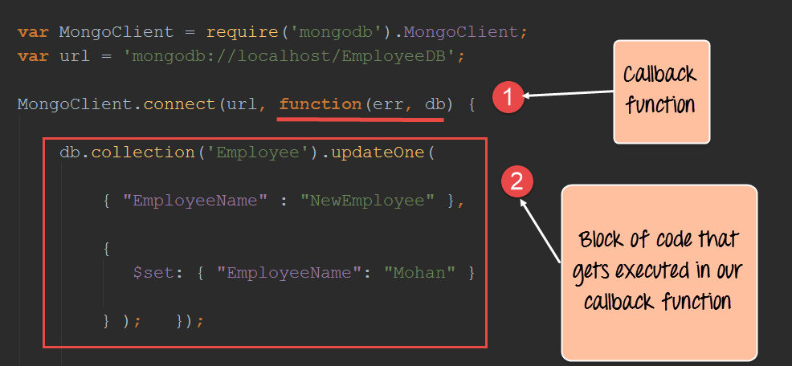

**代码解释：**

1. 上面的代码中，function(err,db) 这段代码被称作匿名函数的声明或者回调函数。当 MongoClient 创建了一个 MongoDB 数据库的连接时，一旦这个连接操作结束，它就会返回到回调函数执行。所以，某种意义上来说，连接操作在后台运行，并且当它结束之后，就会调用这个回调函数。记住这是之所以 Node.js 可以让很多操作同时发生但是不会阻塞用户执行操作的关键。

2. 第二段代码片段就是回调函数被调用的时候真正执行的代码。这个回调函数就在 MongoDB 数据库中更新一条记录。

那么什么是 promise 呢？promise 就是 Node.js 中回调函数的一个改进。在开发的时候，我们可能遇到这样的场景，我们可能需要将多个回调函数嵌套起来。这种情况在一段时间后会变得有些杂乱和难以维护。简单的说，promise 就是来解决回调的这些问题的一个改进版。

promise 的基本语法就像下面这样：

```
var promise = doSomethingAsync();
promise.then(onFullfilled, onRejected);
```

* `doSomethingAsync`指的是任何执行某些异步操作回调或者匿名函数
* 这一次，当定义回调的时候，有一个叫做`promise`的值返回给我们
* 当一个 promise 返回的时候，它有两个输出。这个由`then clause`来定义。这个操作要么成功，这里通过`onFullfilled`参数来表示，要么出错，这里通过`onRejected`参数来表示。

**注意:** 所以 promise 的关键是这个返回值。当我们在 Node.js 中处理正常的回调的时候，并没有返回值的概念。因为有了这个返回值，我们对回调函数有了更多的控制权。

## 回调到 promise

现在让我们看一个例子，看看我们在 Node.js 应用中是如何使用 `promises` 的。为了能够在 Node.js 的应用程序中使用 `promise` ,这个 `promise` 模块首先需要下载和安装。

接下来我们用 promises 来修改我们的代码，来更新 `Employee` 集合中的 Employeename。

1. 	安装 npm 模块

	为了能够在 NodeJS 应用中使用 promise, 我们需要安装这个 promise 模块，运行下面的命令
	npm install promise
	
2. 修改代码来引入 promise

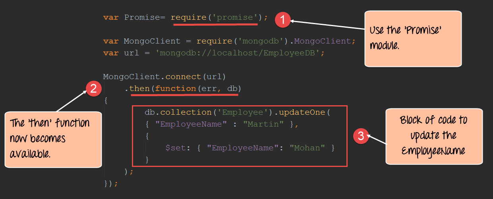

**代码解释：**

1. 第一部分是包含这个`promise`模块，让我们能够在代码中可以使用 promise 的功能。
2. 现在我们可以在 `MongoClient.connect`函数后面添加`then`函数啦。所以，这段代码的意思是当建立数据库连接之后，我们需要执行定义在`then`里面的代码片段。
3. 最后，我们定义了执行更新操作的代码片段

**注意：**

如果你现在检查 MongoDB 数据库，你会发现如果`Martin`雇员的名字存在，它会被更新成`Mohan`.

如果要检查是否在数据库中正确插入，你需要执行下面 MongoDB 的命令。

1. use EmployeeDB
2. db.Employee.find({EmployeeName:mohan})

第一个命令是保证你连上 `EmployeeDB` 的数据库。第二个命令是查找名字为 `Mohan` 的雇员的纪录

## 处理嵌套的 promises

当我们定义 promises 的时候，需要注意的是`then`方法本身返回的也是一个 promise。所以，某种意义上来说 promises 可以嵌套或者链式调用。

下面的例子中，我们使用链式调用来定义了两个回调函数。两个都向数据库插入了一条记录。

**注意：**链式调用是把一个方法的执行链接到另一个上的概念。假如你的应用有两个方法分别叫做`methodA`和`methodB`.并且逻辑是`methodB`要在`methodA`之后调用，这个时候你就可以把这种执行顺序通过在`methodA`之后直接调用`methodB`来链接起来。

这个例子需要注意的关键是通过使用嵌套 promises 使得代码变得更简洁，可读和可维护了。

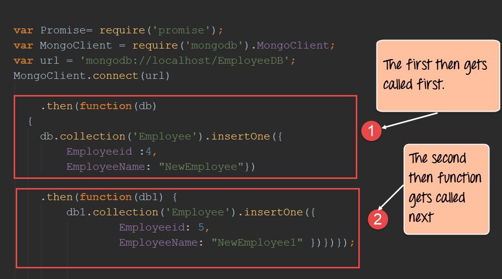

**代码解释：**

1. 我们定义了两个`then`语句来实现在一个执行完之后再执行另一个。第一个`then`语句，我们将包含数据库连接的`db`作为参数传递给它。接下来我们通过使用`db`连接的属性`collection`来插入一条记录。这个`insertOne`方法被用来插入一个真正的文档对象给`Employee`集合。
2. 接下来我们使用第二个`then`语句来向数据库插入另一条记录。

如果你现在查看 MongoDB 数据库，你会在数据库中找到这两条记录。

## 通过 [BlueBird](https://github.com/petkaantonov/bluebird) 库来生成 promises

Bluebird 是一个功能完善的 promise 库。Bluebird 最重要的特性是它能够 `promisify`其他`Node`模块来异步地使用它们。Promisify 是一个应用在回调函数上的概念。这个概念用来保证每一个回调函数会返回一些值。

所以，如果一个 NodeJS 模块包含了一个不返回任何值的回调函数，如果我们 `Promisify`这个`node`模块，那么所有在这个模块内部的函数都会被自动修改保证它有返回值。

所以，你可以使用 Bluebird 让 MongoDB 模块异步运行。这样就从另一层面上提高了写 Node.js 应用程序的舒适性。

我们接下来就看一个如果使用 bluebird 模块的例子。

我们的例子首先建立一个到 `EmployeeDB` 数据库中 `Employee collection`的一个连接。如果接下来连接建立好了，它就会获取所有的集合中的记录并且在控制台中打印出来。

1. 安装 npm 模块
	
	要在 Node 应用程序中使用 Bluebird，必须包含这个模块，运行下面的命令：
	npm install bluebird
	
2. 接下来就是包含这个 bluebird 模块，然后 promise 化整个 MongoDB 模块。这里的 promise 化，我们的意思是 bluebird 确保每一个定义在 MongoDB 类库中的方法都会返回一个 promise。

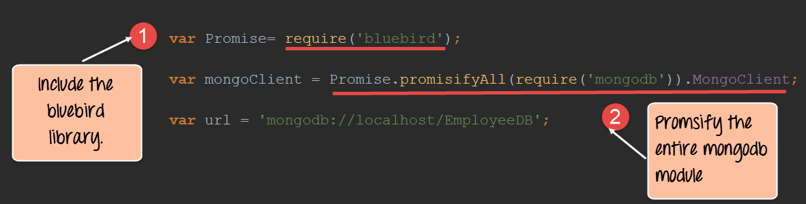

**代码解释：**

* `require`命令是用来包含这个 Bluebird 库的。
* 通过使用 Bluebird 的 `promisifyAll()`这个方法来创建 MongoDB 模块中每一个方法的异步版本。这确保每一个 MongoDB 模块的方法都会在后台中运行，并且确保 MongoDB 库的每一个方法都会返回一个   promise。
3. 最后一步就是连接数据库，获取集合中的所有记录然后在控制台展示它们。

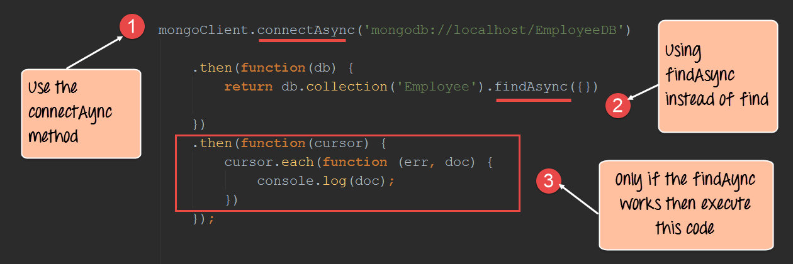

**代码解释：**

1. 你会发现我们这里使用`connectAsync`方法而不是正常的`connect`方法来连接数据库。Bluebird 是通过给每一个方法添加 Async 关键字来区分返回 promise 和不返回 promise 的调用。所以我们并不能保证没有 Async 关键字的方法会有返回值。
2. 和`connectAsync`类似，我们现在使用`findAsync`方法来返回所有在 MongoDB 数据库中 `Employee`集合中的记录。
3. 最后，如果这个 `findAsync`方法成功返回一个 promise ，我们接下来就可以定义一段代码来遍历集合中的每一个记录然后把它们的内容打印出来。

如果上面的步骤正确的执行，所有在`Employee`集合的文档都会被打印到控制台，就像下面这样.

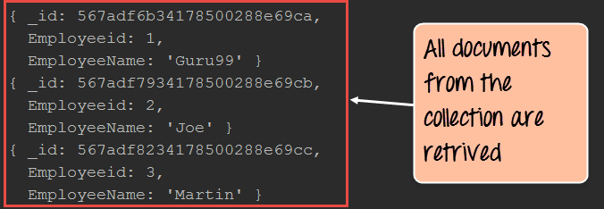

## 创建一个自定义的 promise
 
一个自定义promise可以通过一个叫做`q`的 node 模块来创建。这个`q`模块需要通过 node 包管理工具来下载和安装。在使用`q`这个库之后，这个`denodeify`方法被调用之后会让任何函数变成一个会返回 promise 的函数。
 
下面的例子中，我们首先创建一个简单的函数叫做`Add`，它会把两个数加起来。我们要让这个函数转化为一个返回 promise 对象的函数.

一旦转化成功之后，我们就会通过这个`Add`函数返回的 promise 来在控制台中展示信息

接下来让我们按照下面的方法来创建一个自定义的返回 promise 对象的方法。

1. 安装 npm 模块

	要使用`q`这个模块，我们需要在 NodeJs 应用程序中包含它。安装这个`q`模块，我们可以运行下面的命令
	npm install q
	
2. 定义下面的代码来创建自定义的 promise

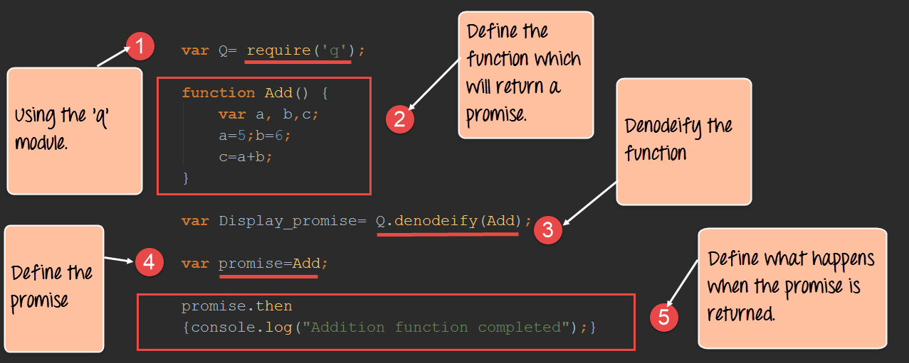

**代码解释：**

1. 第一段的作用是通过`require`关键字包含这个`q`库，通过使用这个库，我们就能够定义任何函数来返回一个回调函数。
2. 我们创建了一个叫做 Add 的函数，它会把两个有变量`a`和`b`表示的数字加起来，结果保存在`c`中。
3. 我们使用`q`库来`denodeify`（用来将任何函数转化成能够返回 promise 的函数的方法）我们的`Add`函数。
4. 现在我们调用这个`Add`函数就能够返回一个 promise ，因为我们之前`denodeify`了这个`Add`函数
5. 这里的`then`关键词被用来表示当函数成功执行之后在控制台中展示`Addition function completed`.

当上面的代码执行之后，就会在控制台输出下面的内容
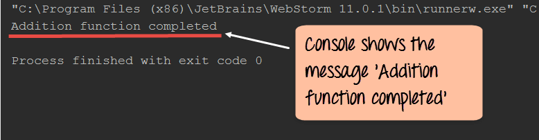

## 什么是 generators

generators 最近在 Node.js 中变得相当有名，这也许和它们能够做的事情有关。

* Generators 是一个能够让函数执行挂起，并且在后面的某个时间点恢复
* Generators 在实现比如说`懒执行`的概念的时候非常有用。这基本意味着通过挂起操作和随心所欲地恢复执行，我们能够只有在我们需要的时候取数据。

Generators 有下面两个关键字:

1. Yield 方法：这个`yield`方法是在要在停止函数执行的时候调用的，函数就在`yield`方法被调用的那一行停止。
2. Next 方法：这个`next`方法从主应用调用去恢复拥有`yield`方法的函数的执行。这个函数会一直执行到遇到下一个`yield`方法或者直到函数的结束.

让我们看一下下面的例子看看 generators 是怎么使用的。

下面的例子中，我们会有一个把两个数字相加的`Add`函数，但是但是我们会在函数中不同的地方停止函数的执行来展示 generators 是如何使用的。

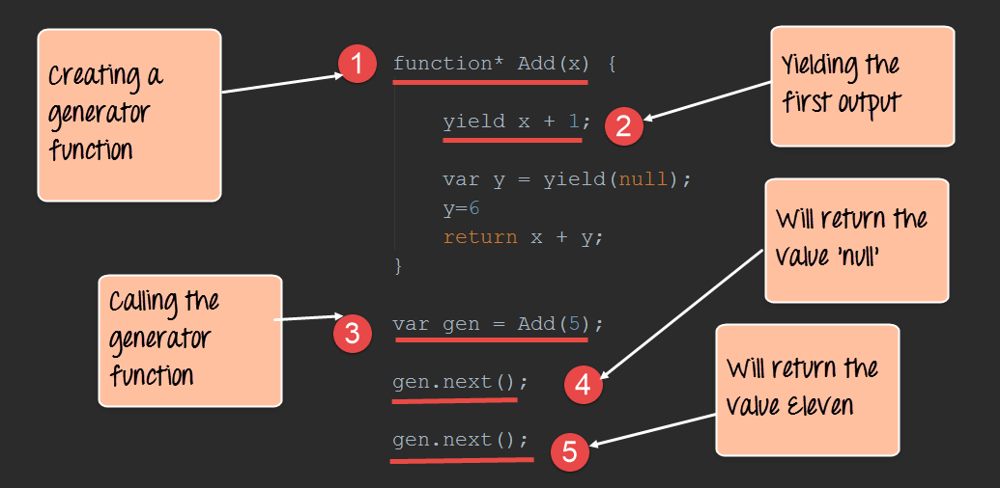

**代码解释：**

1. 第一步是定义我们的 generator 函数。注意这里是通过在 function 关键字后面添加`*`完成的。接下来我们定义一个叫做`Add` 的函数，接受一个`x`作为参数.
2. 这个`yield`关键字只用在 generators 中。这让它拥有能够在函数的人和位置暂停的能力。所以在这里，这个函数会一直停止，知道我们调用`next()`函数，在第4步会调用。在这里，`x`的值会变成6并且函数的执行会停止。
3. 这里就是我们调用 generator 函数并且把 5 作为参数传给这个函数的地方。
4. 一旦我们调用`next()`方法，`Add()`函数会恢复执行。当我们执行到下面这一个语句`var y = yield(null)`的时候又会停止执行。(此时返回的 value 是 6,而不是上面说的 null)
5. 再次调用`next()`方法，一只执行到`return x + y;`结束。（此时返回的 value 是 null,而不是上面说的 11）。
6. 再次调用`next()`方法，会直接返回 11.

## 回调 VS generators
 
 Generators 被用来解决一个叫做回调hell的问题。有些时候在 Node.js 应用中，回调函数嵌套的如此之深以至于它变得太复杂而不能使用回调。
 
 这个时候 Generators 就派上用场啦。一个最常用的例子就是创建定时器函数。
 
 让我们看看下面的例子来看看 generators 是如何证明它比回调更有用的。
 
 我们的例子只创建一个简单的时间延迟函数。我们接下来会在 1s,2s,3s之后调用这个函数。
 
1. 创建一个回调函数有必要的时间延迟的代码

 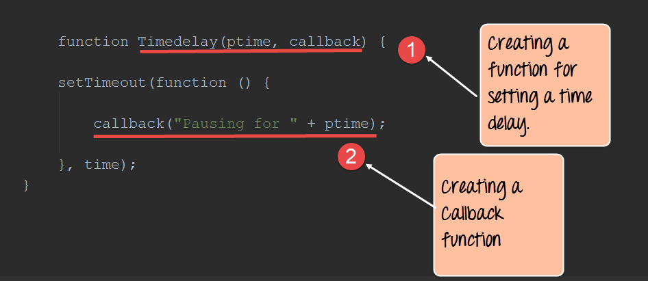
 
 **代码解释：**
 
 * 这里我们创建了一个叫做`Timedelay`的函数，里面包含一个叫做 ptime 的参数，这个可以让我们等待给定的时间来执行回调
 * 下一步就是创建一条消息，告诉用户说这个应用程序会暂停这么多时间

2. 现在我们来看一下如果我们包含很多回调的代码。假如我们想要在每次调用之后都增加 1s 再调用回调函数，下面的代码就是我们需要的用来实现的回调代码。
 
  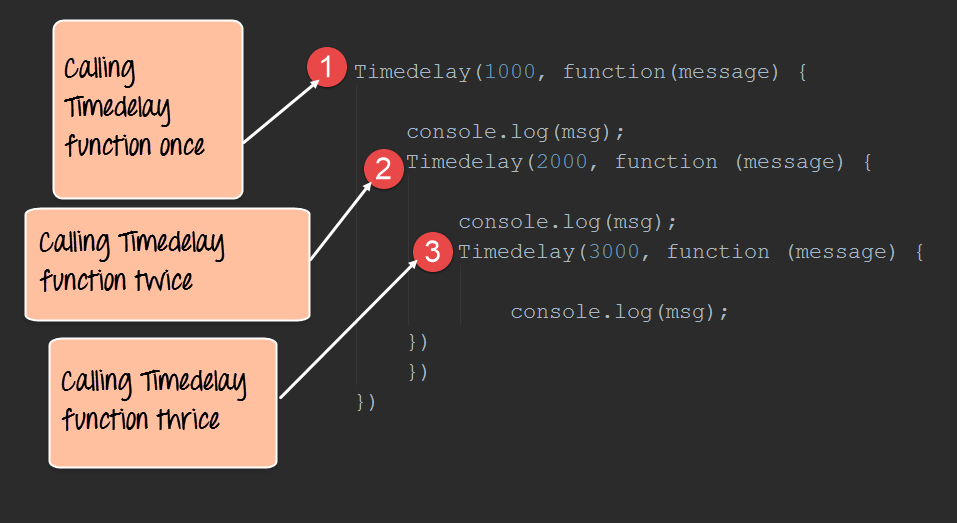
  
  **代码解释：**
  
  * 我们以 1000 作为参数调用 Timedelay 函数
  * 接下来，我们以 2000 作为参数调用 Timedelay 函数
  * 最后，我们以 3000 作为参数调用 Timedelay 函数

 3. 现在我们来看看如何通过 generators 来实现上面一样的功能。
  
  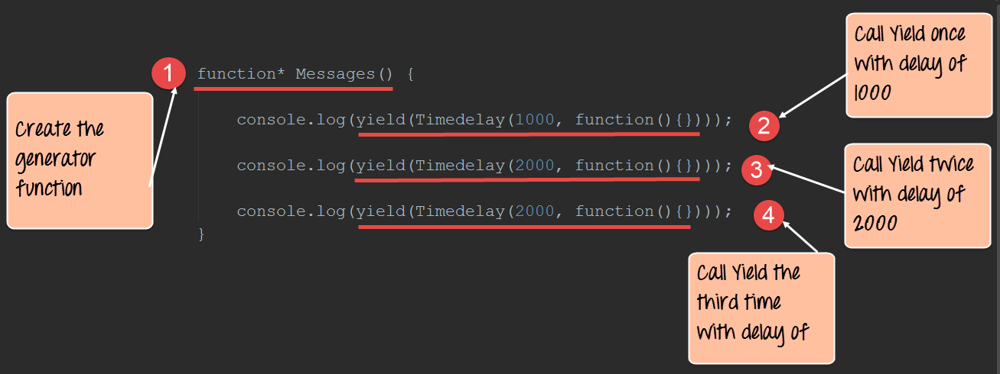
  
  

 

 
